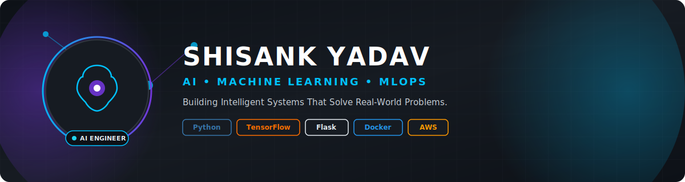
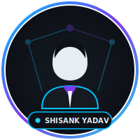
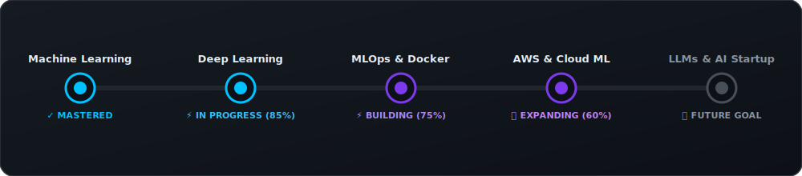
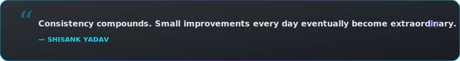

<!-- HERO BANNER -->
<picture>
  <source srcset="./banner.png" type="image/png">
  
</picture>

 

<!-- DYNAMIC TYPING BANNER -->

  <b>📍 India &nbsp;|&nbsp; 📧 <a href="mailto:shisankyadav8@gmail.com">shisankyadav8@gmail.com</a> &nbsp;|&nbsp; 🚀 <a href="https://github.com/Shisank93">github.com/Shisank93</a></b>

<!-- METRICS & BADGES ROW -->

  
  
  
  

<!-- SOCIAL CONNECT BUTTONS -->

  
  
  
  
  
  

 

<!-- SECTION 2: ABOUT ME -->
<table width="100%" border="0" cellspacing="0" cellpadding="0" style="background-color: #161B22; border-radius: 16px; border: 1px solid #30363D;">
  <tr>
    <td width="30%" align="center" style="padding: 25px; vertical-align: middle;">
      <picture>
        <source srcset="./profile.png" type="image/png">
        
      </picture>
      <h3 style="color: #00C2FF; margin-top: 15px; margin-bottom: 5px;">Shisank Yadav</h3>
      
AI &amp; ML Engineer

    </td>
    <td width="70%" style="padding: 25px; color: #E6EDF3; font-family: -apple-system, BlinkMacSystemFont, 'Segoe UI', Roboto, sans-serif;">
      <h2 style="color: #00C2FF; margin-top: 0; display: flex; align-items: center; gap: 8px;">
        ⚡ Executive Biography
      </h2>
      

        I am an <b>AI &amp; Machine Learning Engineering Student</b> dedicated to designing, training, and deploying high-performance production-ready artificial intelligence systems. My engineering philosophy bridges mathematical rigor with modern software engineering and cloud infrastructure.
      

      <ul style="line-height: 1.8; color: #C9D1D9; font-size: 14px; padding-left: 20px;">
        <li>🎯 <b>Current Mission:</b> Mastering Machine Learning algorithms, Deep Neural Networks, MLOps, Docker containerization, and Cloud (AWS) deployment.</li>
        <li>💡 <b>Core Strength:</b> Transforming complex mathematical models into clean, scalable REST APIs and automated continuous machine learning pipelines.</li>
        <li>🚀 <b>Career Goal:</b> Architect scalable intelligent systems, contribute to groundbreaking open-source AI projects, and eventually build a disruptive <b>AI Startup</b>.</li>
      </ul>
    </td>
  </tr>
</table>

 

 

<!-- SECTION 3: CURRENT FOCUS -->
<h2 align="center" style="color: #00C2FF;">🔥 Current Core Focus &amp; Expertise</h2>

<table width="100%" border="0" cellspacing="10" cellpadding="0">
  <tr>
    <td width="33%" style="background-color: #161B22; border: 1px solid #30363D; border-radius: 12px; padding: 20px; vertical-align: top;">
      <h3 style="color: #00C2FF; margin-top: 0;">🧠 Production Machine Learning</h3>
      

        Building end-to-end data ingestion, preprocessing, feature engineering, statistical modeling, and inference pipelines using Scikit-Learn, Pandas, and NumPy.
      

    </td>
    <td width="33%" style="background-color: #161B22; border: 1px solid #30363D; border-radius: 12px; padding: 20px; vertical-align: top;">
      <h3 style="color: #7C3AED; margin-top: 0;">⚡ Deep Learning &amp; Neural Nets</h3>
      

        Architecting, training, and optimizing deep neural networks with TensorFlow and Keras, focusing on loss optimization, overfitting control, and feature embeddings.
      

    </td>
    <td width="33%" style="background-color: #161B22; border: 1px solid #30363D; border-radius: 12px; padding: 20px; vertical-align: top;">
      <h3 style="color: #22D3EE; margin-top: 0;">🐳 MLOps &amp; Containerization</h3>
      

        Containerizing ML workflows using Docker, tracking experiments with MLflow, and building automated continuous deployment pipelines for model serving.
      

    </td>
  </tr>
  <tr>
    <td width="33%" style="background-color: #161B22; border: 1px solid #30363D; border-radius: 12px; padding: 20px; vertical-align: top;">
      <h3 style="color: #22D3EE; margin-top: 0;">☁️ Cloud Infrastructure (AWS)</h3>
      

        Deploying machine learning microservices and Flask APIs on AWS instances with secure environment management, scaling, and database connectivity.
      

    </td>
    <td width="33%" style="background-color: #161B22; border: 1px solid #30363D; border-radius: 12px; padding: 20px; vertical-align: top;">
      <h3 style="color: #00C2FF; margin-top: 0;">🌐 Scalable Backend &amp; APIs</h3>
      

        Engineering high-speed asynchronous REST APIs and web services using Flask &amp; FastAPI, coupled with SQL (MySQL/PostgreSQL) &amp; NoSQL (MongoDB) databases.
      

    </td>
    <td width="33%" style="background-color: #161B22; border: 1px solid #30363D; border-radius: 12px; padding: 20px; vertical-align: top;">
      <h3 style="color: #7C3AED; margin-top: 0;">💡 DSA &amp; Problem Solving</h3>
      

        Rigorous daily algorithmic practice on LeetCode focusing on Dynamic Programming, Graphs, Trees, System Optimization, and space-time complexity analysis.
      

    </td>
  </tr>
</table>

 

 

<!-- SECTION 4: FEATURED PROJECTS -->
<h2 align="center" style="color: #00C2FF;">💼 Featured AI &amp; ML Projects</h2>

<!-- PROJECT 1 -->
<table width="100%" border="0" cellspacing="0" cellpadding="0" style="background-color: #161B22; border: 1px solid #30363D; border-radius: 14px; margin-bottom: 20px;">
  <tr>
    <td style="padding: 24px;">
      

        <h3 style="color: #00C2FF; margin: 0; font-size: 20px;">📊 Student Marks Prediction System</h3>
        

          FLASK WEB APP
        

      

      

        A full-stack predictive machine learning web application built with Python and Flask. Implements regression algorithms to predict student academic performance based on study habits, past scores, and demographic variables. Includes data cleaning, feature scaling, model evaluation, and an interactive frontend interface.
      

      

        
        
        
        
        
      

      

        <a href="https://github.com/Shisank93" target="_blank" style="text-decoration: none; color: #00C2FF; font-weight: 600; font-size: 14px;">View Code &amp; Architecture →</a>
      

    </td>
  </tr>
</table>

<!-- PROJECT 2 -->
<table width="100%" border="0" cellspacing="0" cellpadding="0" style="background-color: #161B22; border: 1px solid #30363D; border-radius: 14px; margin-bottom: 20px;">
  <tr>
    <td style="padding: 24px;">
      

        <h3 style="color: #7C3AED; margin: 0; font-size: 20px;">🛡️ Network Security End-to-End ML Pipeline</h3>
        

          PRODUCTION PIPELINE
        

      

      

        An end-to-end cyber threat detection machine learning pipeline. Automates real-time data ingestion from MongoDB Atlas, data validation, artifact transformation, model training, accuracy drift monitoring, and automated model artifact exporting. Implements modular production-grade Python design patterns with robust custom logging and error handling.
      

      

        
        
        
        
        
      

      

        <a href="https://github.com/Shisank93" target="_blank" style="text-decoration: none; color: #7C3AED; font-weight: 600; font-size: 14px;">View Pipeline Repository →</a>
      

    </td>
  </tr>
</table>

<!-- PROJECT 3 & 4 GRID -->
<table width="100%" border="0" cellspacing="10" cellpadding="0">
  <tr>
    <td width="50%" style="background-color: #161B22; border: 1px solid #30363D; border-radius: 14px; padding: 20px; vertical-align: top;">
      <h3 style="color: #22D3EE; margin-top: 0;">🚀 Machine Learning Production Deployment</h3>
      

        Standardized framework for packaging, containerizing with Docker, and serving Machine Learning models via Flask/FastAPI REST microservices deployed to cloud instances (AWS EC2).
      

      

        
        
        
      

    </td>
    <td width="50%" style="background-color: #161B22; border: 1px solid #30363D; border-radius: 14px; padding: 20px; vertical-align: top;">
      <h3 style="color: #00C2FF; margin-top: 0;">⚙️ Automated MLOps &amp; Experiment Tracking</h3>
      

        Automated machine learning lifecycle management featuring MLflow model registry, hyperparameter tracking, automated data versioning, and CI/CD deployment pipelines.
      

      

        
        
        
      

    </td>
  </tr>
</table>

 

 

<!-- SECTION 5: SKILLS & TECH STACK -->
<h2 align="center" style="color: #00C2FF;">⚡ Technical Skills &amp; Ecosystem</h2>

<table width="100%" border="0" cellspacing="8" cellpadding="0">
  <tr>
    <td width="20%" align="right" style="color: #00C2FF; font-weight: 700; font-size: 14px; padding-right: 15px;">Languages:</td>
    <td>
      
      
      
    </td>
  </tr>
  <tr>
    <td width="20%" align="right" style="color: #7C3AED; font-weight: 700; font-size: 14px; padding-right: 15px;">Machine Learning:</td>
    <td>
      
      
      
      
      
      
      
    </td>
  </tr>
  <tr>
    <td width="20%" align="right" style="color: #22D3EE; font-weight: 700; font-size: 14px; padding-right: 15px;">Backend &amp; Web:</td>
    <td>
      
      
      
    </td>
  </tr>
  <tr>
    <td width="20%" align="right" style="color: #00C2FF; font-weight: 700; font-size: 14px; padding-right: 15px;">Databases:</td>
    <td>
      
      
      
    </td>
  </tr>
  <tr>
    <td width="20%" align="right" style="color: #7C3AED; font-weight: 700; font-size: 14px; padding-right: 15px;">Cloud &amp; DevOps:</td>
    <td>
      
      
      
    </td>
  </tr>
  <tr>
    <td width="20%" align="right" style="color: #22D3EE; font-weight: 700; font-size: 14px; padding-right: 15px;">Tools &amp; MLOps:</td>
    <td>
      
      
      
      
    </td>
  </tr>
</table>

 

 

<!-- SECTION 6: LEARNING ROADMAP -->
<h2 align="center" style="color: #00C2FF;">🗺️ AI Engineering Learning Roadmap</h2>

  

 

 

<!-- SECTION 7: GITHUB STATISTICS -->
<h2 align="center" style="color: #00C2FF;">📊 GitHub Analytics &amp; Achievements</h2>

<table border="0" cellspacing="10" cellpadding="0">
  <tr>
    <td>
      
    </td>
    <td>
      
    </td>
  </tr>
</table>

  

<!-- GITHUB TROPHIES -->

  

 

 

<!-- SECTION 8: LEETCODE & DSA METRICS -->
<h2 align="center" style="color: #FFA116;">🧩 Algorithmic Mastery (LeetCode)</h2>

<table width="100%" border="0" cellspacing="0" cellpadding="0" style="background-color: #161B22; border: 1px solid #30363D; border-radius: 14px;">
  <tr>
    <td width="40%" align="center" style="padding: 20px;">
      
    </td>
    <td width="60%" style="padding: 20px; color: #E6EDF3;">
      <h3 style="color: #FFA116; margin-top: 0;">⚡ LeetCode Profile: @shisank_</h3>
      

        Consistent problem solving in Data Structures and Algorithms focusing on optimization, space-time complexity analysis, and robust clean implementations in Python and Java.
      

      <ul style="color: #8B949E; font-size: 13px; line-height: 1.8;">
        <li>🔹 <b>Primary Languages:</b> Python 3, Java</li>
        <li>🔹 <b>Core Focus:</b> Arrays, Strings, Dynamic Programming, Trees &amp; Graphs</li>
        <li>🔹 <b>Contest Rating:</b> <i>Actively Participating &amp; Building Ranking</i></li>
      </ul>
      <a href="https://leetcode.com/u/shisank_/" target="_blank" style="display: inline-block; background: #FFA116; color: #000; padding: 8px 16px; border-radius: 6px; font-weight: 700; font-size: 13px; text-decoration: none; margin-top: 8px;">Explore LeetCode Solutions →</a>
    </td>
  </tr>
</table>

 

 

<!-- SECTION 9: ACHIEVEMENTS & MILESTONES -->
<h2 align="center" style="color: #00C2FF;">🏆 Milestones &amp; Vision</h2>

  

    🚀 Future Vision: AI Startup Founder
  

  

    My ultimate ambition is to found a high-impact AI startup that solves fundamental real-world industry challenges using autonomous intelligence, scalable machine learning infrastructure, and custom neural architectures.
  

  

    🌐 Open Source &amp; Community Contributions
  

  

    Actively contributing to open-source Machine Learning frameworks, data pipeline tools, and repository templates. Passionate about collaborating with fellow engineers worldwide to advance AI accessibility.
  

  

    📚 Mathematical &amp; Algorithmic Excellence
  

  

    Combining linear algebra, multivariate calculus, statistics, and probability with modern software patterns to build models that perform reliably under production loads.
  

 

 

<!-- SECTION 10: CONTACT & CONNECT -->
<h2 align="center" style="color: #00C2FF;">📫 Let's Connect &amp; Collaborate</h2>

  Whether you want to discuss Machine Learning architecture, MLOps, open-source projects, or AI opportunities — feel free to reach out!

<table border="0" cellspacing="10" cellpadding="0">
  <tr>
    <td align="center" style="background: #161B22; border: 1px solid #00C2FF; border-radius: 12px; padding: 15px 25px;">
      <a href="https://linkedin.com/in/shisank-y-61945431b" target="_blank" style="text-decoration: none; color: #00C2FF; font-weight: 700;">
        💼 LinkedIn shisank-y-61945431b
      </a>
    </td>
    <td align="center" style="background: #161B22; border: 1px solid #7C3AED; border-radius: 12px; padding: 15px 25px;">
      <a href="mailto:shisankyadav8@gmail.com" style="text-decoration: none; color: #7C3AED; font-weight: 700;">
        📧 Email Me shisankyadav8@gmail.com
      </a>
    </td>
    <td align="center" style="background: #161B22; border: 1px solid #22D3EE; border-radius: 12px; padding: 15px 25px;">
      <a href="https://x.com/Shisank_" target="_blank" style="text-decoration: none; color: #22D3EE; font-weight: 700;">
        🐦 X (Twitter) @Shisank_
      </a>
    </td>
  </tr>
</table>

 

 

<!-- SECTION 11: QUOTE -->

  

 

<!-- SECTION 12: FOOTER -->

  

    Designed &amp; Engineered with ❤️ by <b>Shisank Yadav</b> &nbsp;|&nbsp; 
    <a href="#hero-banner" style="color: #00C2FF; text-decoration: none; font-weight: 600;">⬆️ Back to Top</a>
  

